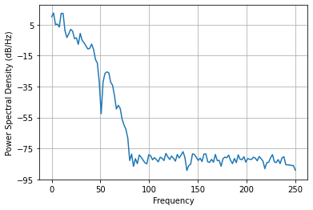
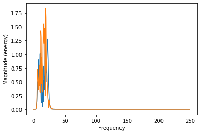

# Conjunto de Dados de EEG para Tarefas de Aritmética Mental

## Introdução

Este conjunto de dados contém gravações de EEG de indivíduos antes e durante a realização de tarefas lógicas e aritméticas. Os sinais de EEG foram registrados usando o sistema Neurocom EEG com 23 canais. Eletrodos de cloreto de prata foram colocados no couro cabeludo de acordo com o sistema internacional 10-20, conforme mostrado na figura abaixo.

*Figura 1: Distribuição dos eletrodos no sistema 10-20*

## Descrição do Conjunto de Dados

O conjunto de dados inclui gravações de 35 sujeitos, com cada sujeito tendo dois arquivos: um registrado antes da tarefa aritmética e o outro durante a tarefa. As gravações antes da tarefa duram 90 segundos, e as durante a tarefa duram 180 segundos, ambas amostradas a 500 Hz.

### Amostra de Dados

Uma amostra dos dados de EEG é mostrada abaixo:

*Figura 2: Dados de EEG brutos do sujeito 0*

### Processamento de Sinal

A análise inicial dos sinais de EEG brutos indicou ruído significativo em frequências baixas e frequências acima de 45 Hz. Para resolver isso, aplicamos um filtro digital passa-banda usando a biblioteca SciPy: um filtro passa-baixa de 5ª ordem a 45 Hz e um filtro passa-alta de 5ª ordem a 12 Hz.

#### Transformada Rápida de Fourier (FFT) e Espectro de Magnitude

- **Antes da Filtragem:**
  
  *Figura 3: FFT do canal Fp1 do sujeito 0 (dados brutos)*

  
  *Figura 4: Espectro de magnitude do canal Fp1 do sujeito 0 (dados brutos)*

- **Após a Filtragem:**
  
  *Figura 5: FFT do canal Fp1 do sujeito 0 (dados filtrados)*

  
  *Figura 6: Espectro de magnitude do canal Fp1 do sujeito 0 (dados filtrados)*

Após a filtragem, os dados de EEG ficaram significativamente mais limpos, conforme ilustrado abaixo:

*Figura 7: Dados de EEG do sujeito 0 após a filtragem*

## Pré-processamento

Para a entrada na rede neural, os dados de EEG foram segmentados em janelas de 0,5 segundos. A segmentação direta resultou em um número insuficiente de amostras de dados, então técnicas de aumento de dados (data augmentation) foram empregadas. As janelas foram divididas em segmentos de 20 segundos com uma sobreposição de 10 segundos, resultando em 180 segmentos antes da tarefa e 599 segmentos durante a tarefa. Esses segmentos foram então divididos em janelas de 0,5 segundos com uma sobreposição de 0,25 segundos, resultando em 14.040 amostras durante a tarefa e 46.722 amostras antes da tarefa.

## Referências

- Zyma, Igor, et al. \"Electroencephalograms during Mental Arithmetic Task Performance.\" Data 4.1 (2019): 14. [DOI:10.3390/data4010014](https://www.mdpi.com/2306-5729/4/1/14)
